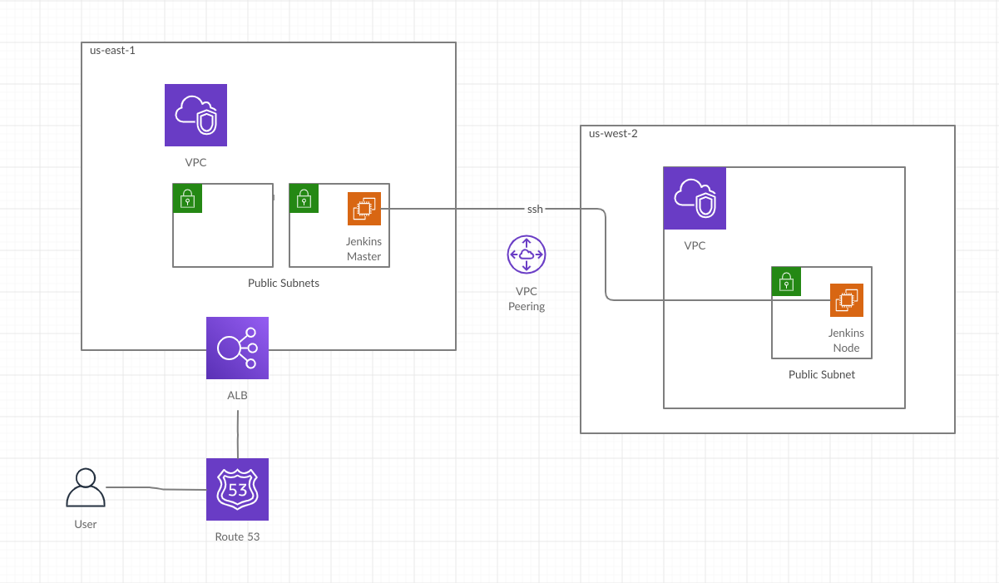

# Distributed, multi-region, jenkins deployment using Terraform and Ansible



AWS services used:

* S3
* VPC
* EC2
* Route 53
* ALB
* ACM

Regions: us-east-1 and us-west-2

## Prerequisites

* AWS account
* AWS credentails populated in ~/.aws/credentials. You can run `aws configure` to populate this file.
* AWS CLI installed on machine where you plan to deploy from
* Terraform (version 12.0.0+) installed on machine where you plan to deploy from
* Ansible installed on machine where you plan to deploy from
* Python boto3 and botocore modules installed on machine where you plan to deploy from `pip install boto3`
* A domain registered within Route53

Versions I used:
* OS Ubuntu 16.04
* Terraform v0.13.3
* Ansible 2.9.9
* aws-cli 1.18.69

## Getting started

Firstly clone this repo and then cd into the repo directory.

Next, before you can deploy this environment, you need to create an AWS S3 bucket. This bucket is used to store Terraform state.

`aws s3api create-bucket --bucket <bucket name>`

Populate the above command with a unique name of your S3 bucket.

You need to change the terraform code so it knows the name of your S3 bucket you created earlier. This can be done with following command.

`sed -i 's/aws-terraform-ansible2020/<bucket name>/' backend.tf`

Next, create a ssh key which will be deloyed to each of the ec2 instance. You can change the location of where your ssh key file is output if you want, but you need to ensure you update instances.tf with the new location.

`ssh-keygen -f /var/tmp/aws_id_rsa -t rsa`

Finally update variables.tf with your domain. The value needs to contain a '.' at the end.

```variable "dns-name" {
  type    = string
  default = "XXX."
}
```

## Deploy

You can now deploy the environment with Terraform.

`terraform plan` will show you what terraform plans to do, i.e how many resources it will add.

If you are happy with the output, then `terraform apply`. Type 'yes' when prompted.


## End Result

Once the deployment has completed, a multi-region Jenkins deployment will exist - master in us-east-1 and a worker node in us-west-2.

You will be able to access jenkins via https://jenkins. + your-domain

Login credentials are admin/password

## Cleanup

You can destroy the environment with `terraform destroy`.

This will remove all resources apart from the S3 bucket. To destroy the S3 bucket you can use the aws cli command `aws s3 rb s3://bucket-name --force`  

